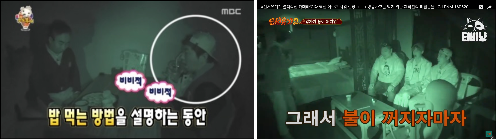

## 졸업하자, 한번에
### Abstract
> 
 : IR Shadow Play: Interactive Media Art Infrared Object Segmentation. 
> 작가 : [Fancy] 윤지희 
> 개발 기간 : 2023.01. ~ 2023.06. 
> 장르 : Interactive Media Art 
> 전시 소개 : 그림자 놀이는 인류의 예술적 상상력의 원천으로 자리잡았다. 아주 먼 옛날부터 촛불, 등잔불 가까이에서 손을 움직여 벽이나 창문에 여러 모양의 그림자를 만드는 것은 즐거움을 선사했다. 이제 적외선 카메라와 객체 분할 기술을 활용하여, 그림자 놀이를 새로운 차원으로 업그레이드하려 한다.

이번 전시는 암실 속의 관람객들이 자신의 그림자를 현대적인 기술인 적외선과 조우시켜 가상의 그림자를 생성하는 새로운 경험을 제공한다. 전통적인 행위 예술과 현대 기술이 만나 참여자들에게 독특하고 감동적인 시각적 체험을 선사한다. 관람객은 그림자 놀이를 새로운 시각으로 경험할 수 있는 기회를 갖게 된다. 이번 전시는 그림자 놀이의 새로운 가능성을 제시하며, 예술적 상상력과 기술적 혁신의 결합이 어떤 아름다운 결과를 만들어낼 수 있는지 보여준다.

### 전시 기획 발단
TV 예능 방송에서는 종종 어두운 곳을 촬영하는 장면들을 종종 만나볼 수 있다.

> 적외선 카메라로 촬영했기 때문에 시청자에게만 보인다.

화면을 자세히 보면, 사람 뒤로 그림자가 생긴게 볼 수 있다.
적외선 카메라인데, 그림자가 보이는게 맞을까?

정답은 YES. 당연하게도 그림자는 생긴다.

그림자는 모든 형태의 빛, 파장에서 나타난다. 당연히 적외선 빛도 우리의 눈에만 보이지 않을 뿐, 빛이므로 이 적외선을 사람이나 물체가 가리면 그림자가 나타난다. 이 그림자는 우리 눈에만 보이는 가시광선으로 생기는 것이 아니기 때문에 평상시에는 보이지 않는것이다.

적외선 카메라에는 두 가지 유형이 있다

1. 단순히 적외선 빛을 촬영
2. 적외선 조명이 카메라에 달려있어, 빛이 없는 곳에서도 촬영

보통 영상을 촬영하는 환경은, 빛이 없거나 적은 공간에서 하는 촬영이기 때문에, 두 번째 경우를 많이 사용한다.

그럼, 이러한 암흑속에 가상의 그림자를 생성해보면 어떨까?

### 전시 기획 의도

### 주요 전시

### Commit Message

### Project Structure

### 주요 전시 미리보기

